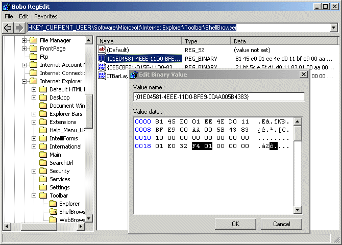



## Bobo RegEdit

### Description

A reasonably complete clone of Regedit.exe

with a few added extras. All coders should be

familiar with the layout and usage of the Registry

If you're not then here it is on a plate !
 
### More Info
 

             |
---                |---
**Submitted On**   |2002-04-04 21:41:20
**By**             |[MrBobo](https://github.com/Planet-Source-Code/PSCIndex/blob/master/ByAuthor/mrbobo.md)
**Level**          |Advanced
**User Rating**    |5.0 (180 globes from 36 users)
**Compatibility**  |VB 6\.0
**Category**       |[Complete Applications](https://github.com/Planet-Source-Code/PSCIndex/blob/master/ByCategory/complete-applications__1-27.md)
**World**          |[Visual Basic](https://github.com/Planet-Source-Code/PSCIndex/blob/master/ByWorld/visual-basic.md)
**Archive File**   |[Bobo\_RegEd68624442002\.zip](https://github.com/Planet-Source-Code/mrbobo-bobo-regedit__1-33399/archive/master.zip)

